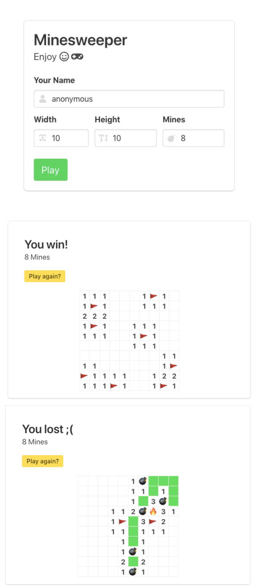

# minesweeper :)

## what is this

This is a game of minesweeper for react and Django challange.

online demo: [http://www.ottocho.net/](http://www.ottocho.net/)




## deployment


This project now is only tested on Debian 9.5 with Python 3.7 and node 8.8 .

requirements:
* django
* reactjs
* mysql

```
# system-level packages
apt-get install mysql-server mysql-client
apt-get install libmariadbclient-dev

# python package
pip3 install django django-cors-headers mysqlclient
```

This project is now using MySQL default. To initialize the database:

```
CREATE DATABASE mines CHARACTER SET UTF8;
CREATE USER mines@localhost IDENTIFIED BY 'mines';
GRANT ALL PRIVILEGES ON mines.* TO mines@localhost;
FLUSH PRIVILEGES;
exit
```

With the django migration:

```
python3 manage.py migrate
```

when deploy the game, there configuration should be confirmed:

1. in `mines/mines_backend/settings.py`, the debug flag should be set to `False`, and serving hosts should be added into `ALLOW_HOSTS`:
    ```
    DEBUG = True

    ALLOWED_HOSTS = [
        'www.ottocho.net',
        '127.0.0.1',
    ]
    ```
2. before building the react project, in `mines/mines_frontend/src/components/Config.js`, the `apiServer` should be set to the domain name that serving the backend service:
    ```
    const apiServer = 'http://www.ottocho.net';
    export default apiServer;
    ```


## Design

The frontend(UI or view) is only based on reactjs, and the backend(api service) is only based on django.

The SPA is built on reactjs, responsible for starting and playing game:

1. `/`: main page to start new game
2. `/game/${game_id}`: game pagge to play game

The backend service is only providing api for frontend.

1. `/api/game/new`: to request a new game
2. `/api/game/get/${game_id}`: to query a game's information
3. `/api/game/${game_id}/${action}`: for game playing operation

The application struction:

```
           +-------------+
           |    nginx    |
           +-------------+
                  |
                  v
           +------+------+
           |     SPA     |   reactjs app
           +---+-----+---+
               |     ^
               | API |
               v     |
           +---+-----+---+
           |   Backend   |   django app
           +-------------+

```

The directory structure:

```
mines/
├── mines_frontend      frontent view: react project
├── mines_api           backend server: django app
├── mines_backend       backend server: django project
├── logs
├── manage.py
├── mines.jpg
└── README.md
```


## TODO

1. support login/auth/session/csrf/etc.
2. support multiple users to play


